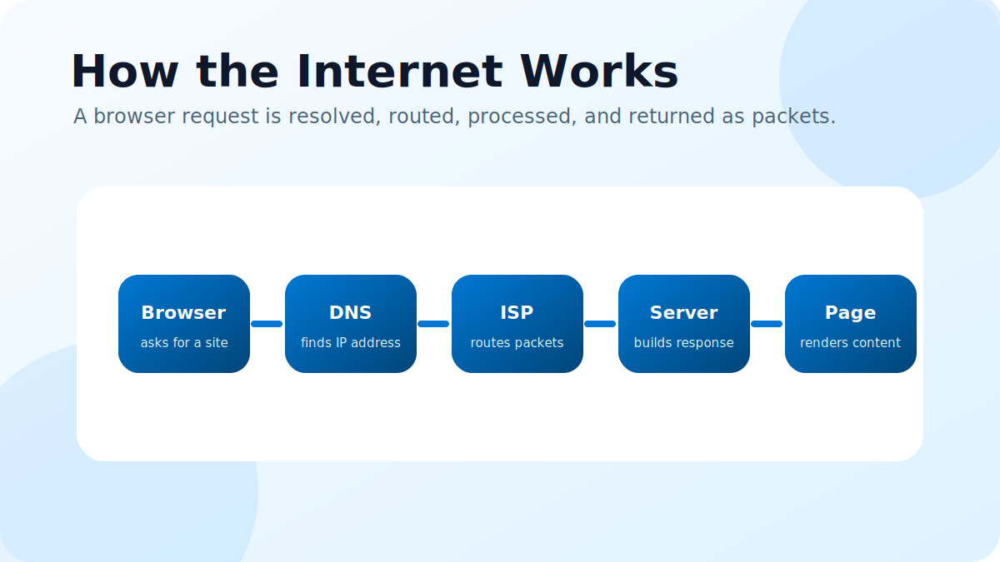

The internet is a global network of connected computers. When you open a website, your browser does not magically jump to that page. It performs a series of small, fast steps.

## 1. Your browser asks for an address

When you type a domain like example.com, the browser first needs to know where that website lives. Human-readable domains are easy for us, but computers route traffic using IP addresses.

## 2. DNS finds the server

DNS works like the internet's phonebook. It translates the domain name into an IP address so your device knows which server should receive the request.

## 3. The request travels through networks

Your request is split into packets. Those packets move from your device to your router, your internet service provider, and then across multiple networks until they reach the destination server.

## 4. The server sends a response

The server receives the request, prepares the required files or data, and sends the response back through the network. This response can include HTML, CSS, JavaScript, images, or API data.

## 5. The browser builds the page

Finally, your browser reads the response and renders the page. It may also request more assets, run JavaScript, and update the screen as more data arrives.

In simple terms, the internet works by converting names into addresses, routing small packets across connected networks, and letting browsers rebuild those packets into useful websites.
