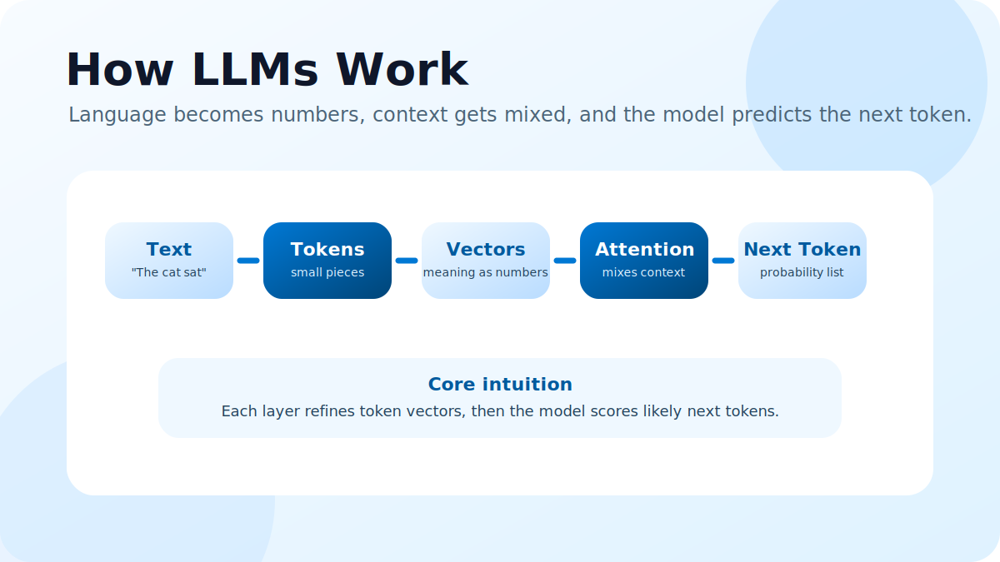

Large language models can feel mysterious, but the core idea is surprisingly approachable: they turn text into numbers, repeatedly mix context, and predict what token should come next.

## The model does not read words like humans do

An LLM first breaks text into tokens. A token can be a whole word, part of a word, punctuation, or even a space-like pattern. The sentence "The cat sat" becomes a short sequence of token IDs.

Those IDs are then mapped into vectors. A vector is simply a list of numbers, but you can imagine it as a point in a high-dimensional meaning space. Similar ideas tend to land in related regions of that space.

## Embeddings are the model's starting map

At the beginning, every token gets an embedding. This embedding does not contain the full meaning of the sentence yet. It is more like a starting coordinate for each token.

The useful part happens as the model updates those vectors layer by layer. Each layer nudges the vectors so they carry more context about the surrounding tokens.

## Attention lets tokens talk to each other

The important visual idea, popularized by explanations like 3Blue1Brown's transformer videos, is attention. Attention asks a question like: "For this token, which other tokens in the context matter most right now?"

For example, in "The animal did not cross the street because it was tired," the token "it" needs context. Attention helps the model connect "it" with the relevant earlier idea.

## Layers refine meaning step by step

A transformer is built from repeated layers. Each layer has attention blocks and small neural networks. Attention mixes information between tokens. The feed-forward network then transforms each token's vector individually.

One layer might capture simple word relationships. Later layers can capture grammar, facts, style, topic, or instructions. The final representation is not a sentence in English; it is a collection of context-rich vectors.

## The model predicts one token at a time

After processing the context, the model produces scores for possible next tokens. These scores are converted into probabilities. The model might decide that "mat" is more likely than "moon" after the phrase "The cat sat on the".

Once a token is selected, it gets added to the text, and the whole process repeats. This loop is why LLMs generate text gradually.

## Why it feels intelligent

LLMs are trained on huge amounts of text by repeatedly practicing next-token prediction. Over time, this forces the model to learn patterns about language, reasoning, facts, code, style, and structure.

The result is not a database lookup. It is a learned function that maps context into likely continuations. The magic feeling comes from the scale: billions of parameters, massive training data, and many layers of contextual processing.

## The simplest mental model

Think of an LLM as a very large prediction engine:

- Text becomes tokens.
- Tokens become vectors.
- Attention mixes context.
- Layers refine meaning.
- The final vector becomes probabilities.
- The next token is chosen.
- The process repeats.

That is the heart of how a modern LLM turns a prompt into a response.
