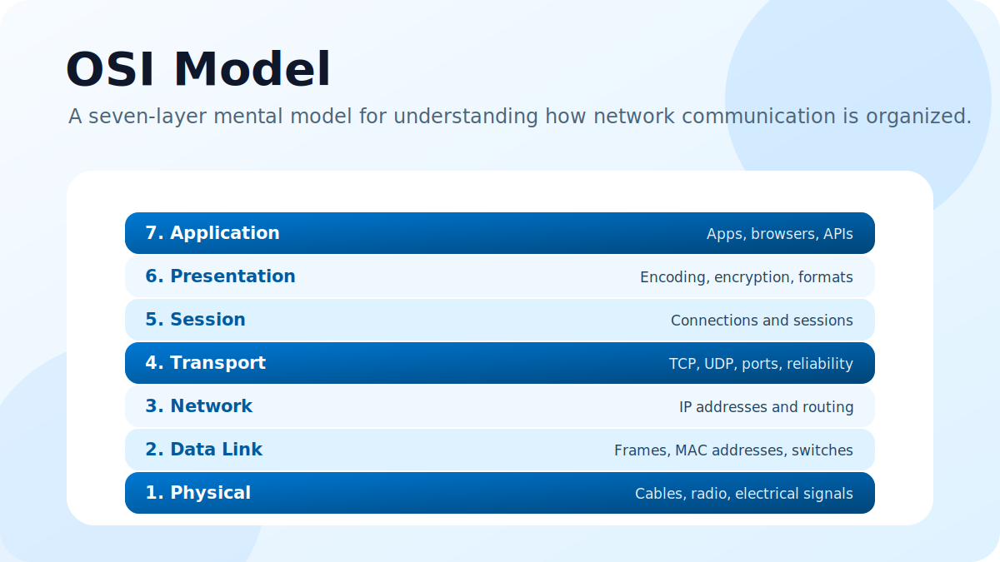

The OSI model is a seven-layer way to understand how data moves across a network. It is not something every modern system follows perfectly, but it is one of the best mental models for debugging network communication.

## Why the OSI model exists

Networking can feel messy because many things happen at once: electrical signals, Wi-Fi, IP addresses, ports, encryption, browser requests, and application data.

The OSI model separates those responsibilities into layers. Each layer solves a specific part of the communication problem and passes work to the layer below or above it.

## Layer 1: Physical

The physical layer is about raw signals. It includes cables, fiber, radio waves, electrical pulses, and the hardware that physically moves bits from one place to another.

If a cable is unplugged or Wi-Fi signal is weak, the problem is close to this layer.

## Layer 2: Data Link

The data link layer handles communication within the same local network. It uses frames and MAC addresses. Switches mainly operate here.

This layer helps devices on the same network segment send data to each other reliably.

## Layer 3: Network

The network layer is where IP addresses and routing live. Routers use this layer to decide where packets should go next.

When people talk about packets traveling across the internet, they are usually talking about this layer.

## Layer 4: Transport

The transport layer manages communication between processes using ports. TCP and UDP are the most common examples.

TCP focuses on reliable delivery, ordering, and retransmission. UDP is lighter and faster, but does not guarantee delivery in the same way.

## Layer 5: Session

The session layer is about managing conversations between systems. It keeps track of sessions, connection state, and when communication starts or ends.

In practice, some of this responsibility is handled by application protocols and libraries.

## Layer 6: Presentation

The presentation layer deals with data format. It includes encoding, compression, serialization, and encryption.

For example, converting structured data into JSON or encrypting traffic with TLS relates to the kind of work this layer describes.

## Layer 7: Application

The application layer is closest to the user. It includes protocols and systems that applications use directly, like HTTP, DNS, SMTP, and APIs.

When your browser requests a web page, the visible application-level behavior lives here.

## A simple way to remember it

Think of the OSI model as a stack:

- Physical moves raw bits.
- Data Link moves frames locally.
- Network routes packets globally.
- Transport manages ports and delivery.
- Session manages conversations.
- Presentation formats and protects data.
- Application serves user-facing protocols.

When something breaks in a network, the OSI model gives you a clean checklist for asking: "At which layer is the problem happening?"
